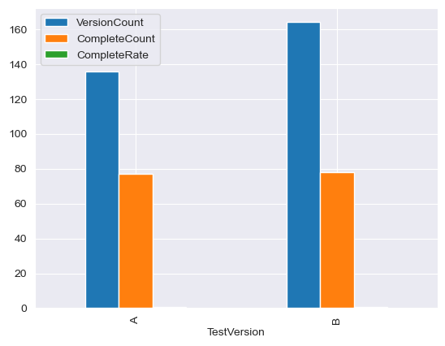

# A/B Testing

**A/B testing**, also known as split testing, is a methodical process used in marketing and user experience design to compare two versions of a webpage, email, advertisement, or other marketing materials. The goal is to determine which version performs better in achieving a specific objective, such as increasing click-through rates, conversions, or other key performance indicators (KPIs).

## Table of Contents

1. [Import Moduels and Load Dataset](#import_moduel_load_data)
2. [Explore the dataset](#explore_dataset)
3. [Analyze the results](#analyze_result)
4. [Conclusion](#conclusion)


***

## <a id="import_moduel_load_data">Import Moduels and Load Dataset</a>


```python
import pandas as pd
import numpy as np
import matplotlib.pyplot as plt
%matplotlib inline
import seaborn as sns
sns.set_style("darkgrid")
```

<div class="alert alert-block alert-warning">
The dataset used in the following process is pseudo data.
</div>


```python
ab_data = pd.read_csv('fake_data/ab_test/ab_test_interactions.csv')
ab_data.head()
```


<div>
<style scoped>
    .dataframe tbody tr th:only-of-type {
        vertical-align: middle;
    }

    .dataframe tbody tr th {
        vertical-align: top;
    }

    .dataframe thead th {
        text-align: right;
    }
</style>
<table border="1" class="dataframe">
  <thead>
    <tr style="text-align: right;">
      <th></th>
      <th>InteractionID</th>
      <th>UserID</th>
      <th>TimeStamp</th>
      <th>TestVersion</th>
      <th>FormCompletion</th>
      <th>FullName</th>
      <th>Email</th>
      <th>CompanyName</th>
      <th>PhoneNumber</th>
      <th>CompanySize</th>
    </tr>
  </thead>
  <tbody>
    <tr>
      <th>0</th>
      <td>1</td>
      <td>1</td>
      <td>2024-02-04 10:19:14.353603</td>
      <td>A</td>
      <td>True</td>
      <td>Ryan Ross</td>
      <td>ljones@example.com</td>
      <td>Anderson-Sandoval</td>
      <td>372-467-3669x002</td>
      <td>Medium</td>
    </tr>
    <tr>
      <th>1</th>
      <td>2</td>
      <td>2</td>
      <td>2024-01-27 21:00:44.704737</td>
      <td>B</td>
      <td>True</td>
      <td>Barry Cook</td>
      <td>evansalejandro@example.net</td>
      <td>Villa, Ryan and Brewer</td>
      <td>NaN</td>
      <td>NaN</td>
    </tr>
    <tr>
      <th>2</th>
      <td>3</td>
      <td>3</td>
      <td>2024-01-24 12:31:46.238756</td>
      <td>A</td>
      <td>True</td>
      <td>Andrea Ochoa</td>
      <td>shawn16@example.com</td>
      <td>Robles Inc</td>
      <td>001-408-424-3217x2093</td>
      <td>Large</td>
    </tr>
    <tr>
      <th>3</th>
      <td>4</td>
      <td>4</td>
      <td>2024-02-04 17:27:19.938596</td>
      <td>B</td>
      <td>True</td>
      <td>Judith Sawyer</td>
      <td>youngdenise@example.net</td>
      <td>Hess-Lee</td>
      <td>NaN</td>
      <td>NaN</td>
    </tr>
    <tr>
      <th>4</th>
      <td>5</td>
      <td>5</td>
      <td>2024-02-05 17:32:09.721651</td>
      <td>A</td>
      <td>True</td>
      <td>Alexis Watson</td>
      <td>tylerjohnson@example.org</td>
      <td>Robertson, Webster and Casey</td>
      <td>354.516.8019x9052</td>
      <td>Large</td>
    </tr>
  </tbody>
</table>
</div>


### <a id='explore_dataset'>Explore the dataset</a>


```python
version_count = ab_data.groupby('TestVersion')['FormCompletion'].count().rename('VersionCount')
complete_count = ab_data.groupby('TestVersion')['FormCompletion'].sum().rename('CompleteCount')
complete_rate = ab_data.groupby('TestVersion')['FormCompletion'].mean().rename('CompleteRate')

ab_stats = pd.concat([version_count, complete_count, complete_rate], axis=1)

ab_stats.plot(kind='bar')
```


    <Axes: xlabel='TestVersion'>


    

    


### <a id='analyze_result'>Analyze the results</a>

Since the data we want to measure is binary data (fail/success), it's regarded as categorical data. We could use <b>Chi-Squared</b> test to do the hypothesis testing. 


```python
from scipy.stats import chi2_contingency

# Create a contingency table
contingency_table = pd.crosstab(ab_data['TestVersion'], ab_data['FormCompletion'])

# Perform the chi-square test
chi2, p_value, dof, expected = chi2_contingency(contingency_table)

# Output the test statistic and p-value
print(f'Chi-square statistic: {chi2}, P-value: {p_value}')

```

    Chi-square statistic: 2.0927724572017694, P-value: 0.1479972765404778


### <a id='conclusion'>Conclusion</a>

The result shows there's **no statistical significance** between the two version of landing page in generating leads. The P-value is way above 0.05, the number needed to be considered as statistical significant.
