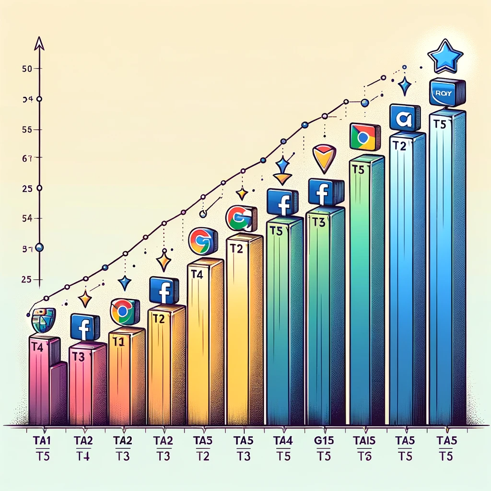

## Hi, I'm Karen. I'm a Marketing/Growth Data Analyst,and Content Strategist. 

I'm on a thrilling journey where I get to blend my passion for numbers and storytelling into the exciting world of business.

My career kicked off as a content strategist, but I couldn't stop pondering: Did my content actually lead to those awesome conversions? What worked like magic, and what fell a bit flat? 🤔

These curious question marks set me on a path towards data analytics, the golden key to unlocking those answers. My mission? To make marketing strategies smarter, reach wider audiences, and save a boatload of resources (both money and energy).

This repository is my treasure trove of experiments aimed at making marketing "smarter." Think classic analysis tools like <b>Marketing Attribution</b>, <b>Segmentation Analysis</b>, <b>A/B testing</b>, <b>ROI analysis</b>, and even some innovative tricks like <b>Similarity analysis</b>. 

Exciting stuff, right? Keep your eyes peeled for more, as there's always more in the pipeline! 🚀

<blockquote>
    <strong><em>Data skills:</em></strong> SQL (Aggregation, Window Functions, CTE), Python (Pandas, Numpy, Seaborn, Matplotlib, Sklearn),Tableau, KQL, Microsoft Excel,Google Sheets 
    <strong><em>Knowledge:</em></strong> Marketing Attribution models, Segmentation analysis, A/B testing, ROI analysis 
    <strong><em>Tools:</em></strong> Google Analytics, Google Tag Manager, Google BigQuery, Azure Data Explorer, Google Data Studio, Mode Analytics, Tableau
</blockquote>

    <h2>Projects: Ways to Make Marketing Smarter</h2>
    

        <h3> 1. Multi-Touch Attribution (MTA) </h3>
            
 The Multi-Touch Attribution (MTA) model is a classic approach for evaluating the contribution of marketing channels to final sales. It assists marketing decision-makers in better allocating their resources, whether financial or personnel. Furthermore, the marketing team can calculate the return on investment (ROI) of their efforts by comparing the sales generated by each channel against the costs incurred.
            
There are several MTA (Multi-Touch Attribution) models, including <i>First Touch, Last Touch, Time-Decay, Position-Based, U-Shaped, and Data-Driven</i>, among others. Here, I am implementing one of the most popular attribution models, namely,<i><b>Time-Decay Attribition Model</b></i>. 
           

              
            

            
<i><b>Time-Decay Attribition Model</b></i> usually use this following calculation as decay factor:<b> weight = 0.5(t/half-life)</b>. In this model, <b>'t'</b> represents the time difference between a touchpoint and the final conversion. The <b>'half-life'</b> is typically set to 7, indicating that the influence on conversion is halved every seven days. 

            
<a href="Exponential_Time_Decay_Attribution_Model.md">See how I run Exponential Time-Decay Attribution Model step by step in Python</a> 
            
 
    

    

        <h3>2. Segmentation Analysis</h3>
        
<i><b>Segmentation Analysis</b></i> is usually used to gain insights from analyzing the demographics or behavior of the users. <i><b>RFM model (Recency, Frequency, Monetary)</b></i> is one of the most popular approaches to classify users and explore hidden insights, and crafting customized messages accordingly. 
             
        The most classical way of doing an <i><b>RFM model</b></i> is putting users into eight groups through rating them and score the rating up by each dimension, then the marketer could do customer analysis to have a clear picture of the customer portrait.  
         
        Another method is using <i><b>K-means Clustering</b></i> to generate the clusters, instead of using manually rating. Then, marketer needs to do further research on each clusters, in order to gain insights on the features of each cluster. 
        

        
<a href="Segmentation_analysis_RFM.md">See how I use both approaches to do a RFM Segmentation Analysis</a> 
        
  
    

    

        <h3>3. A/B Testing</h3>
        
<i><b>A/B testing</b></i>, also known as split testing, is a methodical process used in marketing and user experience design to compare two versions of a webpage, email, advertisement, or other marketing materials. The goal is to determine which version performs better in achieving a specific objective, such as increasing click-through rates, conversions, or other key performance indicators (KPIs).

        
<a href="Segmentation_analysis_RFM.md">See how I do an A/B test to refine a SaaS landing page</a> 
    
