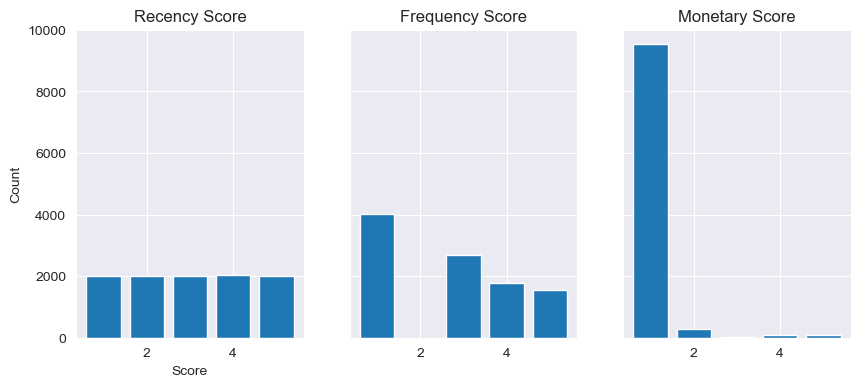
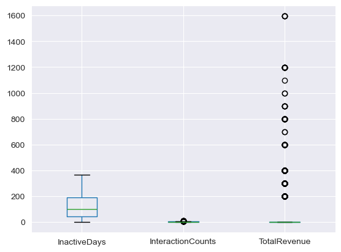
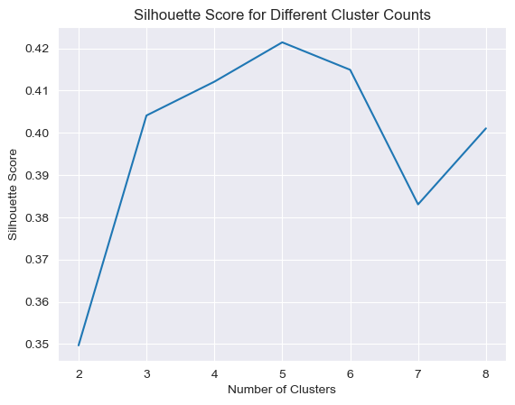
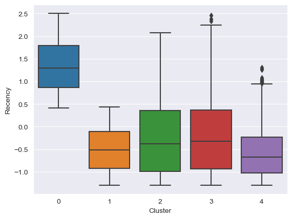
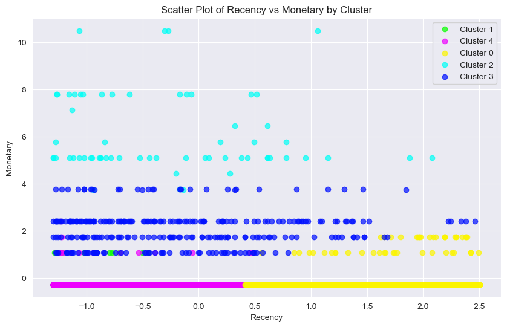
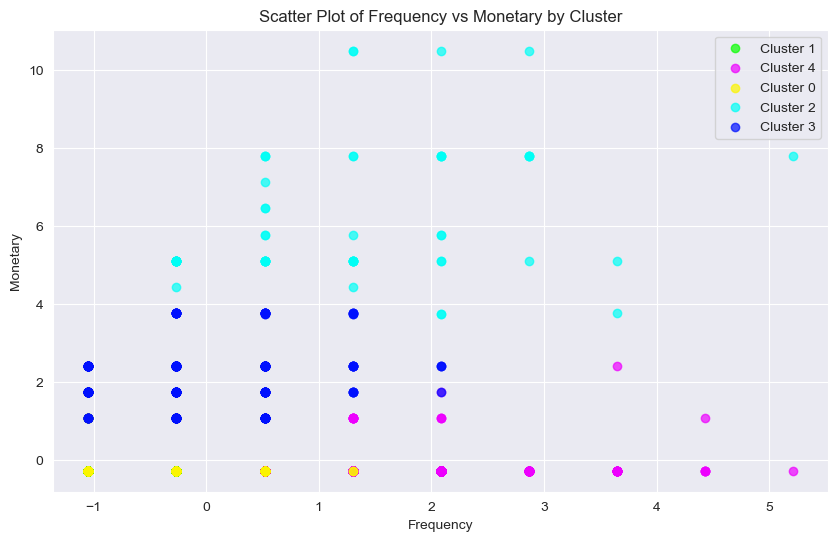

# Segmentation Analysis Using RFM Model

## Table of Content

1. [Import Moduels and Load Dataset](#import_moduel_load_data)
2. [Exploring Segmentation Analysis: The RFM Model Approach](#rfm)<br>
3. [Data Prep](#rfm_data_prep)<br>
4. [Approach A: Grouping Users Based on Recency, Frequency, and Monetary (RFM) Dimensions](#rfm_rating_user)<br>
    a. [Setting Threshold Manually](#rfm_setting_threshold_manually)<br>
    b. [Segmenting Users](#rfm_segmenting_users)<br>
5. [Approach B: User Grouping through K-means Cluster Analysis](#rfm_k_means)<br>
    a. [Normalization](#normalization)<br>
    b. [Silhouette Score](#silhouette_score)<br>
    c. [Execute the K-means algorithm using the optimized number of clusters](#kmeans_execution)<br>
    d. [Visualizing the Clusters](#visualization)<br>
6. [References](#reference)
    

***

## <a id="import_moduel_load_data">Import Moduels and Load Dataset</a>


```python
import pandas as pd
import numpy as np
import matplotlib.pyplot as plt
%matplotlib inline
import seaborn as sns
sns.set_style("darkgrid")
```

<div class="alert alert-block alert-warning">
The dataset used in the following process is pseudo data.
</div>


```python
# Load the dataset
interaction_df = pd.read_csv("fake_data/segmentation_RFM/customer_interaction.csv") 
subscription_df = pd.read_csv("fake_data/segmentation_RFM/customer_subscription.csv") 

# Combine the two datasets
merge_df = pd.merge(interaction_df, subscription_df, on=["UserID","ContentType"], how="left")

# Drop rows that has ContentType conflicts
merge_df = merge_df.rename(columns={"ContentType":"ProductPurchased","TimeStamp":"LatestInteractionTime"})

# Turn columns into datetime objects
merge_df["LatestInteractionTime"] = pd.to_datetime(merge_df["LatestInteractionTime"])
merge_df["StartDate"] = pd.to_datetime(merge_df["StartDate"])
merge_df["EndDate"] = pd.to_datetime(merge_df["EndDate"])
```


```python
merge_df.head()
```


<div>
<style scoped>
    .dataframe tbody tr th:only-of-type {
        vertical-align: middle;
    }

    .dataframe tbody tr th {
        vertical-align: top;
    }

    .dataframe thead th {
        text-align: right;
    }
</style>
<table border="1" class="dataframe">
  <thead>
    <tr style="text-align: right;">
      <th></th>
      <th>InteractionID</th>
      <th>UserID</th>
      <th>LatestInteractionTime</th>
      <th>ProductPurchased</th>
      <th>InteractionType</th>
      <th>SubscriptionID</th>
      <th>StartDate</th>
      <th>EndDate</th>
      <th>Revenue</th>
    </tr>
  </thead>
  <tbody>
    <tr>
      <th>0</th>
      <td>1</td>
      <td>3636</td>
      <td>2023-11-04 11:26:41.545065</td>
      <td>Online Course</td>
      <td>view</td>
      <td>NaN</td>
      <td>NaT</td>
      <td>NaT</td>
      <td>NaN</td>
    </tr>
    <tr>
      <th>1</th>
      <td>2</td>
      <td>242</td>
      <td>2023-10-29 23:01:56.097041</td>
      <td>Online Course</td>
      <td>load</td>
      <td>NaN</td>
      <td>NaT</td>
      <td>NaT</td>
      <td>NaN</td>
    </tr>
    <tr>
      <th>2</th>
      <td>3</td>
      <td>3814</td>
      <td>2023-09-09 02:57:41.910663</td>
      <td>Newsletter</td>
      <td>load</td>
      <td>NaN</td>
      <td>NaT</td>
      <td>NaT</td>
      <td>NaN</td>
    </tr>
    <tr>
      <th>3</th>
      <td>4</td>
      <td>3548</td>
      <td>2023-03-20 23:17:49.613562</td>
      <td>Newsletter</td>
      <td>view</td>
      <td>NaN</td>
      <td>NaT</td>
      <td>NaT</td>
      <td>NaN</td>
    </tr>
    <tr>
      <th>4</th>
      <td>5</td>
      <td>20</td>
      <td>2023-09-13 12:24:54.655336</td>
      <td>Podcast</td>
      <td>click</td>
      <td>NaN</td>
      <td>NaT</td>
      <td>NaT</td>
      <td>NaN</td>
    </tr>
  </tbody>
</table>
</div>


## <a id="rfm"> About Segmentation Analysis through an RFM Model</a>
There are hundreds of ways to perform segmentation analysis, from demographic analysis to behavior analysis. <b>The RFM model</b> is one of the most popular methods for segmenting users based on three dimensions: <b>Recency</b>, <b>Frequency</b>, and <b>Monetary</b>.<br>
<br>
By categorizing users into eight types (representing all possible combinations of the three dimensions), marketers can identify the most profitable segments and create tailor-made marketing messages to increase sales. Furthermore, by conducting additional analyses on each segment—such as <b>cross-channel analysis</b>, <b>A/B testing</b>, or even <b>predicting future behavior and customer lifetime values</b>—marketers can gain a deeper understanding of their user profiles and devise more effective marketing plans.<br>
<br>
There are two common ways to do RFM grouping. The first approach is group users based on rating of the three dimensions.The altrenative is to do it through K-means clustering. In the following sections, I will demonstrate how to do it step by step.


## <a id='rfm_data_prep'>Data Prep</a>


```python
# Calculate inactive days, prep for following Recency analysis

import time

# Set a time
t = "2024-01-30"
current_time = pd.to_datetime(t)
merge_df['InactiveDays']= merge_df['LatestInteractionTime'].apply(lambda x: current_time-x).dt.days
```


```python
# Calculate accumlated interactions by userID, prep for following Frequency analysis

interaction_count = merge_df.groupby('UserID')['InteractionID'].count().to_dict()
merge_df['InteractionCounts']= merge_df['UserID'].map(interaction_count)
```


```python
# Calculate sum of revenue by UserID, prep for following revenue analysis

total_revenue = merge_df.groupby('UserID')['Revenue'].sum().to_dict()
merge_df['TotalRevenue']= merge_df['UserID'].map(total_revenue)
```

***

## <a id='rfm_rating_user'>Approach A: Grouping Users Based on Recency, Frequency, and Monetary (RFM) Dimensions</a>


```python
# Calculate quantiles once outside the function
quantiles_recency = merge_df["InactiveDays"].quantile([0.2, 0.4, 0.6, 0.8])

# Write a function to classify the values in Series
def classify_recency(x, quantiles):
    if x > quantiles[0.8]:
        return 1
    elif quantiles[0.6] < x <= quantiles[0.8]:
        return 2
    elif quantiles[0.4] < x <= quantiles[0.6]:
        return 3
    elif quantiles[0.2] < x <= quantiles[0.4]:
        return 4
    else:
        return 5

# Apply the function to each element of the Series
merge_df["RecencyScore"] = merge_df["InactiveDays"].apply(lambda x: classify_recency(x, quantiles_recency))

```


```python
# Calculate quantiles once outside the function: frequency
quantiles_frequency = merge_df["InteractionCounts"].quantile([0.2, 0.4, 0.6, 0.8])

# Monetary
revenue_distribution = merge_df["TotalRevenue"].unique()
quantiles_monetary = pd.Series(revenue_distribution).quantile([0.2, 0.4, 0.6, 0.8])

def classify_frequency_revenue(y, quantiles):
    if y > quantiles[0.8]:
        return 5
    elif quantiles[0.6] < y <= quantiles[0.8]:
        return 4
    elif quantiles[0.4] < y <= quantiles[0.6]:
        return 3
    elif quantiles[0.2] < y <= quantiles[0.4]:
        return 2
    else:
        return 1

merge_df['FrequencyScore'] = merge_df["InteractionCounts"].apply(lambda y: classify_frequency_revenue(y, quantiles_frequency))
merge_df['MonetaryScore'] = merge_df["TotalRevenue"].apply(lambda y: classify_frequency_revenue(y, quantiles_monetary))

```


```python
#Filter out a clea RFM table
rfm_df = merge_df[['UserID','RecencyScore','FrequencyScore','MonetaryScore']]
```

### <a id='rfm_setting_threshold_manually'>Setting Threshold Manually</a>

Now, with all users are tagged with Recency Score, Frequency Score, and Monetary Score, marketers can divide them into no less than <b>eight groups</b>:<br>

|       |Recency|Frequency|Monetary|Feature    |Strategy   |
|:-----|:-----|:-------|:------|:---------|:---------|
|   1   | High  | High    | High   |Champions  |Reward loyalty, upsell higher value products, and engage them as brand advocates.|
|   2   | High  | Low     | High   |Potential Loyalists|Encourage repeat purchases through onboarding programs or membership offers.|    
|   3   | High  | High    | Low    |Loyal Customers|Encourage higher-value purchases through personalized recommendations.|
|   4   | High  | Low     | Low    |New Enthusiasts|Welcome and nurture them to build a stronger relationship; educate them about products/services.|
|   5   | Low   | High    | High   |At-Risk Customers|Re-engage with personalized messages and offers; seek feedback to understand any issues.|
|   6   | Low   | Low     | High   |Price-Sensitive|Win them back with reactivation campaigns and special offers.|
|   7   | Low   | High    | Low    |Dromant User|Offer discounts or value deals to encourage more frequent purchases.|
|   8   | Low   | Low     | Low    |Nearly Lost|Last chance offers; understand their needs to possibly rekindle the relationship.|

Setting a threshold is an art. You can set the threshold based on the following considerations:

1. Based on <b>the distribution of user scores</b>
2. Based on your <b>business goals</b>

For example:

If the score distribution is skewed (either to the left or right), you can adjust your threshold to balance the number of users on both sides more evenly. The following charts show that the score distribution in MonetaryScore is heavily right-skewed. We could set the threshold much lower, such as at 2, to balance the number of people in each cluster.

As for the RecencyScore and FrequencyScore, we could define scores of 4 & 5 as "High" and 1, 2, & 3 as "Low".


```python
fig, ax = plt.subplots(1, 3, sharey=True, figsize=(10, 4))  # 1 row, 3 columns

# For each subplot, specify the x (categories) and y (values) for the bar plot
recency_counts = rfm_df['RecencyScore'].value_counts()
ax[0].bar(recency_counts.index, recency_counts.values)

frequency_counts = rfm_df['FrequencyScore'].value_counts()
ax[1].bar(frequency_counts.index, frequency_counts.values)

monetary_counts = rfm_df['MonetaryScore'].value_counts()
ax[2].bar(monetary_counts.index, monetary_counts.values)

# Set titles for each subplot to make it clear what each one represents
ax[0].set_title('Recency Score')
ax[1].set_title('Frequency Score')
ax[2].set_title('Monetary Score')

# Set the x and y labels
ax[0].set_xlabel('Score')
ax[0].set_ylabel('Count')

plt.show()

```


    

    


We could also design a threshold to achieve **business goals**.<br>

For example, if the company is aiming to retain the most recent users in 30 days, the threshold in RecencyScore could be set higher to 5.<br> 

### <a id='rfm_segmenting_users'>Segmenting Users</a>

Now, we can generate the clusters based on our thrsholds. In this case, let's set the "High RecencyScore" bar at 5, the "High FrequencyScore" bar at 4 and above, the "High MonetaryScore" bar at 2 and above.
<br>
<br>
Here are the eight groups:


```python
# Create the eight clusters with the threshold above

champions_hhh = rfm_df.query('RecencyScore>4 & FrequencyScore>3 & MonetaryScore>1')
potential_loyalists_hlh = rfm_df.query('RecencyScore>4 & FrequencyScore<4 & MonetaryScore>1')
loyal_customer_hhl = rfm_df.query('RecencyScore>4 & FrequencyScore>3 & MonetaryScore<2')
new_enthusiast_hll = rfm_df.query('RecencyScore>4 & FrequencyScore<4 & MonetaryScore<2')
at_risk_lhh = rfm_df.query('RecencyScore<5 & FrequencyScore>3 & MonetaryScore>1')
price_sensitive_llh = rfm_df.query('RecencyScore<5 & FrequencyScore<4 & MonetaryScore>1')
dormant_user_lhl = rfm_df.query('RecencyScore<5 & FrequencyScore>3 & MonetaryScore<2')
nearly_lost_lll =  rfm_df.query('RecencyScore<5 & FrequencyScore<4 & MonetaryScore<2')
```


```python
# Print user counts of each cluster

print('There are',champions_hhh.shape[0],'users in the Champion group.')
print('There are',potential_loyalists_hlh.shape[0],'users in the Potential Loyalist group.')
print('There are',loyal_customer_hhl.shape[0],'users in the Loyal Customer group.')
print('There are',new_enthusiast_hll.shape[0],'users in the New Enthusiast group.')
print('There are',at_risk_lhh.shape[0],'users in the At Risk group.')
print('There are',price_sensitive_llh.shape[0],'users in the Price Sensitive group.')
print('There are',dormant_user_lhl.shape[0],'users in the Dormant User group.')
print('There are',nearly_lost_lll.shape[0],'users in the Nearly Lost group.')
```

    There are 37 users in the Champion group.
    There are 56 users in the Potential Loyalist group.
    There are 605 users in the Loyal Customer group.
    There are 1311 users in the New Enthusiast group.
    There are 178 users in the At Risk group.
    There are 224 users in the Price Sensitive group.
    There are 2495 users in the Dormant User group.
    There are 5114 users in the Nearly Lost group.


```python
# Create a disctionary of user group and user counts and turn it into a Dataframe
user_group = ['champions',
               'potential_loyalists',
               'loyal_customer',
               'new_enthusiast',
               'at_risk',
               'price_sensitive',
               'dormant_user',
               'nearly_lost']

user_counts = [champions_hhh.shape[0],
             potential_loyalists_hlh.shape[0],
             loyal_customer_hhl.shape[0],
             new_enthusiast_hll.shape[0],
             at_risk_lhh.shape[0],
             price_sensitive_llh.shape[0],
             dormant_user_lhl.shape[0],
             nearly_lost_lll.shape[0]]

user_dict = {'UserGroup':user_group,'UserCounts':user_counts}

user_counts_df = pd.DataFrame(user_dict)

# Add a percentage column 
user_counts_total = user_counts_df['UserCounts'].sum()
user_counts_df['Percentage'] = round((user_counts_df['UserCounts']/user_counts_total)*100,2)

user_counts_df.sort_values(by='UserCounts',ascending= False)
```


<div>
<style scoped>
    .dataframe tbody tr th:only-of-type {
        vertical-align: middle;
    }

    .dataframe tbody tr th {
        vertical-align: top;
    }

    .dataframe thead th {
        text-align: right;
    }
</style>
<table border="1" class="dataframe">
  <thead>
    <tr style="text-align: right;">
      <th></th>
      <th>UserGroup</th>
      <th>UserCounts</th>
      <th>Percentage</th>
    </tr>
  </thead>
  <tbody>
    <tr>
      <th>7</th>
      <td>nearly_lost</td>
      <td>5114</td>
      <td>51.04</td>
    </tr>
    <tr>
      <th>6</th>
      <td>dormant_user</td>
      <td>2495</td>
      <td>24.90</td>
    </tr>
    <tr>
      <th>3</th>
      <td>new_enthusiast</td>
      <td>1311</td>
      <td>13.08</td>
    </tr>
    <tr>
      <th>2</th>
      <td>loyal_customer</td>
      <td>605</td>
      <td>6.04</td>
    </tr>
    <tr>
      <th>5</th>
      <td>price_sensitive</td>
      <td>224</td>
      <td>2.24</td>
    </tr>
    <tr>
      <th>4</th>
      <td>at_risk</td>
      <td>178</td>
      <td>1.78</td>
    </tr>
    <tr>
      <th>1</th>
      <td>potential_loyalists</td>
      <td>56</td>
      <td>0.56</td>
    </tr>
    <tr>
      <th>0</th>
      <td>champions</td>
      <td>37</td>
      <td>0.37</td>
    </tr>
  </tbody>
</table>
</div>


With the groups are now clearly defined, marketers are able to do **customer profiling**, and better understand their **channel preferences**, **customer lifecycle status**, for making future *customized promotion messages*, *A/B testing*, and *behavioral predictions*.  

***

## <a id='rfm_k_means'>Approach B: User Grouping through K-means Cluster Analysis</a>

Instead setting a grouping threshold, another approach of doing user grouping is through **K-means Clustering.**<br>
<br>**K-means Clustering** is a part of unsupervised learning family in AI. It is used to group similar data points together in a process known as clustering. <a href='https://www.analyticsvidhya.com/blog/2019/08/comprehensive-guide-k-means-clustering/'>(source)</a> 


```python
import sklearn
from sklearn.preprocessing import StandardScaler
from sklearn.cluster import KMeans
from sklearn.metrics import silhouette_score
```


```python
# Create a RFM dataframe for following analysis
rfm_kmeans = merge_df[['UserID','InactiveDays','InteractionCounts','TotalRevenue']].sort_values(by='UserID')
rfm_kmeans = rfm_kmeans.groupby('UserID').min().reset_index()

# Check rfm dataframe dustribution
rfm_normalized = rfm_kmeans[['InactiveDays','InteractionCounts','TotalRevenue']]
rfm_normalized.boxplot() 
```


    <Axes: >


    

    


### <a id='normalization'>Normalization</a>
Before applying K-means, normalizing the Recency, Frequency, and Monetary scores is crucial for the following reasons:
1. **Standardize different scales and ranges**: Without normalization, these differences in scale can skew the clustering process.<br>
2. **Equal Importance**: Ensures that each of the three dimensions (Recency, Frequency, Monetary) contributes equally to the clustering process.<br>
3. **Improved Clustering Performance**: Normalized data can help K-means algorithm converge more quickly and efficiently.<br>
<br>
<div class="alert alert-block alert-info">I use <b>Z-score normalization</b>, which is also known as <b>standardization</b>, for normalizing the RFM (Recency, Frequency, Monetary) data.</div>


```python
# Use StandardScaler from Python's scikit-learn library

from sklearn.preprocessing import StandardScaler

scaler = StandardScaler()
rfm_normalized = scaler.fit_transform(rfm_normalized)
rfm_normalized = pd.DataFrame(rfm_normalized)

# rfm_normalized.boxplot()
rfm_normalized.rename(columns={0:'Recency',1:'Frequency',2:'Monetary'})
```


<div>
<style scoped>
    .dataframe tbody tr th:only-of-type {
        vertical-align: middle;
    }

    .dataframe tbody tr th {
        vertical-align: top;
    }

    .dataframe thead th {
        text-align: right;
    }
</style>
<table border="1" class="dataframe">
  <thead>
    <tr style="text-align: right;">
      <th></th>
      <th>Recency</th>
      <th>Frequency</th>
      <th>Monetary</th>
    </tr>
  </thead>
  <tbody>
    <tr>
      <th>0</th>
      <td>-1.013384</td>
      <td>-0.263309</td>
      <td>-0.27178</td>
    </tr>
    <tr>
      <th>1</th>
      <td>-0.815623</td>
      <td>0.518594</td>
      <td>-0.27178</td>
    </tr>
    <tr>
      <th>2</th>
      <td>-0.139070</td>
      <td>0.518594</td>
      <td>-0.27178</td>
    </tr>
    <tr>
      <th>3</th>
      <td>0.495848</td>
      <td>-0.263309</td>
      <td>-0.27178</td>
    </tr>
    <tr>
      <th>4</th>
      <td>-1.107061</td>
      <td>1.300497</td>
      <td>-0.27178</td>
    </tr>
    <tr>
      <th>...</th>
      <td>...</td>
      <td>...</td>
      <td>...</td>
    </tr>
    <tr>
      <th>4283</th>
      <td>0.901779</td>
      <td>0.518594</td>
      <td>-0.27178</td>
    </tr>
    <tr>
      <th>4284</th>
      <td>-1.221554</td>
      <td>-0.263309</td>
      <td>-0.27178</td>
    </tr>
    <tr>
      <th>4285</th>
      <td>-0.794806</td>
      <td>-0.263309</td>
      <td>-0.27178</td>
    </tr>
    <tr>
      <th>4286</th>
      <td>-1.086244</td>
      <td>0.518594</td>
      <td>-0.27178</td>
    </tr>
    <tr>
      <th>4287</th>
      <td>-0.399283</td>
      <td>0.518594</td>
      <td>-0.27178</td>
    </tr>
  </tbody>
</table>
<p>4288 rows × 3 columns</p>
</div>


### <a id='silhouette_score'>Silhouette Score</a>

The silhouette score provides a way to assess the appropriateness of the number of clusters by measuring how well each data point fits into its assigned cluster. **Higher silhouette scores indicate better-defined clusters.**


```python
# List to store silhouette scores
silhouette_scores = []
ssd = []
range_n_clusters = [2,3,4,5,6,7,8]

for num_clusters in range_n_clusters:
    kmeans = KMeans(n_clusters = num_clusters, max_iter=50)
    kmeans.fit(rfm_normalized)
    
    cluster_labels = kmeans.labels_
    
    #silhouette score
    silhouette_avg = silhouette_score(rfm_normalized, cluster_labels)
    silhouette_scores.append(silhouette_avg)
    
    print("For n_clusters={0}, the silhouette score is {1}".format(num_clusters, silhouette_avg))

```

    /Users/KarenDing/anaconda3/lib/python3.11/site-packages/sklearn/cluster/_kmeans.py:870: FutureWarning: The default value of `n_init` will change from 10 to 'auto' in 1.4. Set the value of `n_init` explicitly to suppress the warning
      warnings.warn(


    For n_clusters=2, the silhouette score is 0.34968598877022017


    /Users/KarenDing/anaconda3/lib/python3.11/site-packages/sklearn/cluster/_kmeans.py:870: FutureWarning: The default value of `n_init` will change from 10 to 'auto' in 1.4. Set the value of `n_init` explicitly to suppress the warning
      warnings.warn(


    For n_clusters=3, the silhouette score is 0.4041030401542475


    /Users/KarenDing/anaconda3/lib/python3.11/site-packages/sklearn/cluster/_kmeans.py:870: FutureWarning: The default value of `n_init` will change from 10 to 'auto' in 1.4. Set the value of `n_init` explicitly to suppress the warning
      warnings.warn(


    For n_clusters=4, the silhouette score is 0.4121058424640369


    /Users/KarenDing/anaconda3/lib/python3.11/site-packages/sklearn/cluster/_kmeans.py:870: FutureWarning: The default value of `n_init` will change from 10 to 'auto' in 1.4. Set the value of `n_init` explicitly to suppress the warning
      warnings.warn(


    For n_clusters=5, the silhouette score is 0.42142215914800246


    /Users/KarenDing/anaconda3/lib/python3.11/site-packages/sklearn/cluster/_kmeans.py:870: FutureWarning: The default value of `n_init` will change from 10 to 'auto' in 1.4. Set the value of `n_init` explicitly to suppress the warning
      warnings.warn(


    For n_clusters=6, the silhouette score is 0.4149176067009878


    /Users/KarenDing/anaconda3/lib/python3.11/site-packages/sklearn/cluster/_kmeans.py:870: FutureWarning: The default value of `n_init` will change from 10 to 'auto' in 1.4. Set the value of `n_init` explicitly to suppress the warning
      warnings.warn(


    For n_clusters=7, the silhouette score is 0.38306023864310823


    /Users/KarenDing/anaconda3/lib/python3.11/site-packages/sklearn/cluster/_kmeans.py:870: FutureWarning: The default value of `n_init` will change from 10 to 'auto' in 1.4. Set the value of `n_init` explicitly to suppress the warning
      warnings.warn(


    For n_clusters=8, the silhouette score is 0.4010574675093411


According to Silhouette score, clusters will be better defined with cluster number is **5**. <br>
We would see this trend better when compare the silhouette score from different numbers of clusters.


```python
import matplotlib.pyplot as plt

plt.plot(range_n_clusters, silhouette_scores)
plt.xlabel('Number of Clusters')
plt.ylabel('Silhouette Score')
plt.title('Silhouette Score for Different Cluster Counts')
plt.show()
```


    

    


### <a id='kmeans_execution'>Execute the K-means algorithm using the optimized number of clusters</a>

Based on our finding, let's set the cluster number to **5**.


```python
kmeans = KMeans(n_clusters=5, max_iter=50)
kmeans.fit(rfm_normalized)
```

    /Users/KarenDing/anaconda3/lib/python3.11/site-packages/sklearn/cluster/_kmeans.py:870: FutureWarning: The default value of `n_init` will change from 10 to 'auto' in 1.4. Set the value of `n_init` explicitly to suppress the warning
      warnings.warn(


<style>#sk-container-id-1 {color: black;background-color: white;}#sk-container-id-1 pre{padding: 0;}#sk-container-id-1 div.sk-toggleable {background-color: white;}#sk-container-id-1 label.sk-toggleable__label {cursor: pointer;display: block;width: 100%;margin-bottom: 0;padding: 0.3em;box-sizing: border-box;text-align: center;}#sk-container-id-1 label.sk-toggleable__label-arrow:before {content: "▸";float: left;margin-right: 0.25em;color: #696969;}#sk-container-id-1 label.sk-toggleable__label-arrow:hover:before {color: black;}#sk-container-id-1 div.sk-estimator:hover label.sk-toggleable__label-arrow:before {color: black;}#sk-container-id-1 div.sk-toggleable__content {max-height: 0;max-width: 0;overflow: hidden;text-align: left;background-color: #f0f8ff;}#sk-container-id-1 div.sk-toggleable__content pre {margin: 0.2em;color: black;border-radius: 0.25em;background-color: #f0f8ff;}#sk-container-id-1 input.sk-toggleable__control:checked~div.sk-toggleable__content {max-height: 200px;max-width: 100%;overflow: auto;}#sk-container-id-1 input.sk-toggleable__control:checked~label.sk-toggleable__label-arrow:before {content: "▾";}#sk-container-id-1 div.sk-estimator input.sk-toggleable__control:checked~label.sk-toggleable__label {background-color: #d4ebff;}#sk-container-id-1 div.sk-label input.sk-toggleable__control:checked~label.sk-toggleable__label {background-color: #d4ebff;}#sk-container-id-1 input.sk-hidden--visually {border: 0;clip: rect(1px 1px 1px 1px);clip: rect(1px, 1px, 1px, 1px);height: 1px;margin: -1px;overflow: hidden;padding: 0;position: absolute;width: 1px;}#sk-container-id-1 div.sk-estimator {font-family: monospace;background-color: #f0f8ff;border: 1px dotted black;border-radius: 0.25em;box-sizing: border-box;margin-bottom: 0.5em;}#sk-container-id-1 div.sk-estimator:hover {background-color: #d4ebff;}#sk-container-id-1 div.sk-parallel-item::after {content: "";width: 100%;border-bottom: 1px solid gray;flex-grow: 1;}#sk-container-id-1 div.sk-label:hover label.sk-toggleable__label {background-color: #d4ebff;}#sk-container-id-1 div.sk-serial::before {content: "";position: absolute;border-left: 1px solid gray;box-sizing: border-box;top: 0;bottom: 0;left: 50%;z-index: 0;}#sk-container-id-1 div.sk-serial {display: flex;flex-direction: column;align-items: center;background-color: white;padding-right: 0.2em;padding-left: 0.2em;position: relative;}#sk-container-id-1 div.sk-item {position: relative;z-index: 1;}#sk-container-id-1 div.sk-parallel {display: flex;align-items: stretch;justify-content: center;background-color: white;position: relative;}#sk-container-id-1 div.sk-item::before, #sk-container-id-1 div.sk-parallel-item::before {content: "";position: absolute;border-left: 1px solid gray;box-sizing: border-box;top: 0;bottom: 0;left: 50%;z-index: -1;}#sk-container-id-1 div.sk-parallel-item {display: flex;flex-direction: column;z-index: 1;position: relative;background-color: white;}#sk-container-id-1 div.sk-parallel-item:first-child::after {align-self: flex-end;width: 50%;}#sk-container-id-1 div.sk-parallel-item:last-child::after {align-self: flex-start;width: 50%;}#sk-container-id-1 div.sk-parallel-item:only-child::after {width: 0;}#sk-container-id-1 div.sk-dashed-wrapped {border: 1px dashed gray;margin: 0 0.4em 0.5em 0.4em;box-sizing: border-box;padding-bottom: 0.4em;background-color: white;}#sk-container-id-1 div.sk-label label {font-family: monospace;font-weight: bold;display: inline-block;line-height: 1.2em;}#sk-container-id-1 div.sk-label-container {text-align: center;}#sk-container-id-1 div.sk-container {/* jupyter's `normalize.less` sets `[hidden] { display: none; }` but bootstrap.min.css set `[hidden] { display: none !important; }` so we also need the `!important` here to be able to override the default hidden behavior on the sphinx rendered scikit-learn.org. See: https://github.com/scikit-learn/scikit-learn/issues/21755 */display: inline-block !important;position: relative;}#sk-container-id-1 div.sk-text-repr-fallback {display: none;}</style><div id="sk-container-id-1" class="sk-top-container"><div class="sk-text-repr-fallback"><pre>KMeans(max_iter=50, n_clusters=5)</pre><b>In a Jupyter environment, please rerun this cell to show the HTML representation or trust the notebook. <br />On GitHub, the HTML representation is unable to render, please try loading this page with nbviewer.org.</b></div><div class="sk-container" hidden><div class="sk-item"><div class="sk-estimator sk-toggleable"><input class="sk-toggleable__control sk-hidden--visually" id="sk-estimator-id-1" type="checkbox" checked><label for="sk-estimator-id-1" class="sk-toggleable__label sk-toggleable__label-arrow">KMeans</label><div class="sk-toggleable__content"><pre>KMeans(max_iter=50, n_clusters=5)</pre></div></div></div></div></div>


```python
# rfm_normalized.loc[:,'UserID'] = rfm['UserID']
rfm_normalized = rfm_normalized.rename(columns={0:'Recency',1:'Frequency',2:'Monetary'})
```


```python
rfm_normalized['Cluster'] = kmeans.labels_
rfm_normalized
```


<div>
<style scoped>
    .dataframe tbody tr th:only-of-type {
        vertical-align: middle;
    }

    .dataframe tbody tr th {
        vertical-align: top;
    }

    .dataframe thead th {
        text-align: right;
    }
</style>
<table border="1" class="dataframe">
  <thead>
    <tr style="text-align: right;">
      <th></th>
      <th>Recency</th>
      <th>Frequency</th>
      <th>Monetary</th>
      <th>Cluster</th>
    </tr>
  </thead>
  <tbody>
    <tr>
      <th>0</th>
      <td>-1.013384</td>
      <td>-0.263309</td>
      <td>-0.27178</td>
      <td>1</td>
    </tr>
    <tr>
      <th>1</th>
      <td>-0.815623</td>
      <td>0.518594</td>
      <td>-0.27178</td>
      <td>4</td>
    </tr>
    <tr>
      <th>2</th>
      <td>-0.139070</td>
      <td>0.518594</td>
      <td>-0.27178</td>
      <td>4</td>
    </tr>
    <tr>
      <th>3</th>
      <td>0.495848</td>
      <td>-0.263309</td>
      <td>-0.27178</td>
      <td>0</td>
    </tr>
    <tr>
      <th>4</th>
      <td>-1.107061</td>
      <td>1.300497</td>
      <td>-0.27178</td>
      <td>4</td>
    </tr>
    <tr>
      <th>...</th>
      <td>...</td>
      <td>...</td>
      <td>...</td>
      <td>...</td>
    </tr>
    <tr>
      <th>4283</th>
      <td>0.901779</td>
      <td>0.518594</td>
      <td>-0.27178</td>
      <td>0</td>
    </tr>
    <tr>
      <th>4284</th>
      <td>-1.221554</td>
      <td>-0.263309</td>
      <td>-0.27178</td>
      <td>1</td>
    </tr>
    <tr>
      <th>4285</th>
      <td>-0.794806</td>
      <td>-0.263309</td>
      <td>-0.27178</td>
      <td>1</td>
    </tr>
    <tr>
      <th>4286</th>
      <td>-1.086244</td>
      <td>0.518594</td>
      <td>-0.27178</td>
      <td>4</td>
    </tr>
    <tr>
      <th>4287</th>
      <td>-0.399283</td>
      <td>0.518594</td>
      <td>-0.27178</td>
      <td>4</td>
    </tr>
  </tbody>
</table>
<p>4288 rows × 4 columns</p>
</div>


### <a id='visualization'>Visualizing the Cluters</a>

<div class="alert alert-block alert-info">Before create the visualization, let's take a look at the distribution of each clusters.</div>


```python
sns.boxplot(x='Cluster',y='Recency',data=rfm_normalized )
```


    <Axes: xlabel='Cluster', ylabel='Recency'>


    

    


#### <a id='r_vs_f'>Plotting Recency against Frequency</a>


```python
import matplotlib.pyplot as plt
import seaborn as sns

# Set the color palette
palette = sns.color_palette("hsv", len(rfm_normalized['Cluster'].unique()))

# Plotting Recency vs. Frequency
plt.figure(figsize=(10, 6))
for cluster in rfm_normalized['Cluster'].unique():
    # Filter the data for one cluster
    cluster_data = rfm_normalized[rfm_normalized['Cluster'] == cluster]
    
    # Plot the data for this cluster
    plt.scatter(cluster_data['Recency'], cluster_data['Frequency'], 
                color=palette[cluster], label=f'Cluster {cluster}', alpha=0.7)

plt.title('Scatter Plot of Recency vs Frequency by Cluster')
plt.xlabel('Recency')
plt.ylabel('Frequency')
plt.legend()
plt.show()

```


    

    


##### Insights:
<li>Customers with high recency and high frequency are often the most valuable; they engage often and have done so recently.</li>
<li>Customers with high frequency but low recency may be lapsing and could be targets for re-engagement campaigns.</li>
<li>Customers with low frequency and high recency are often new customers who might be encouraged to engage more often.</li>

#### <a id='r_vs_m'>Plotting Recency against Monetary</a>


```python
# Plotting Recency vs. Monetary

plt.figure(figsize=(10, 6))
for cluster in rfm_normalized['Cluster'].unique():
    # Filter the data for one cluster
    cluster_data = rfm_normalized[rfm_normalized['Cluster'] == cluster]
    
    # Plot the data for this cluster
    plt.scatter(cluster_data['Recency'], cluster_data['Monetary'], 
                color=palette[cluster], label=f'Cluster {cluster}', alpha=0.7)

plt.title('Scatter Plot of Recency vs Monetary by Cluster')
plt.xlabel('Recency')
plt.ylabel('Monetary')
plt.legend()
plt.show()

```


    

    


##### Insights:
<li>Customers with high recency and high monetary value are likely to be big spenders and recent buyers, making them prime targets for upselling or cross-selling.</li>
<li>Customers with low recency but high monetary value may have been valuable in the past but are at risk of churning.</li>

#### <a id='r_vs_f'>Plotting Frequency against Monetary</a>


```python
# Plotting Frequency vs. Monetary

plt.figure(figsize=(10, 6))
for cluster in rfm_normalized['Cluster'].unique():
    # Filter the data for one cluster
    cluster_data = rfm_normalized[rfm_normalized['Cluster'] == cluster]
    
    # Plot the data for this cluster
    plt.scatter(cluster_data['Frequency'], cluster_data['Monetary'], 
                color=palette[cluster], label=f'Cluster {cluster}', alpha=0.7)

plt.title('Scatter Plot of Frequency vs Monetary by Cluster')
plt.xlabel('Frequency')
plt.ylabel('Monetary')
plt.legend()
plt.show()

```


    

    


##### Insight:
<li>Customers with both high frequency and high monetary value are your most loyal and high-spending customers.</li>
<li>Customers with high frequency but low monetary value might be frequent buyers of lower-value items; there might be an opportunity to upsell higher-value products to them.</li>

### Following are analyses that could be done after generating the K-means clusters

| No. | Analysis| How to do it                                      |    
|:---|:-----------------|:------------------------------------------|
|  1  | Segment Profiling |Develop detailed profiles for each cluster, including their preferences, behaviors, and demographics.Identify the most profitable segments for targeted marketing strategies|
|  2  | Customer Lifecycle Analysis| Look at the customer lifecycle stages of each segment. Tailor marketing and service efforts to move customers toward higher-value segments| 
|  3  | Predictive Modeling | Use the clusters as inputs for predictive models to forecast future customer behavior, lifetime value, or the likelihood of churn|
|  4  | A/B Testing | Test different engagement strategies for each segment to see what works best in terms of increasing frequency, recency, and monetary value|
|  5  | Cross-Channel Analysis | Examine the role of different marketing channels within each segment to optimize channel strategy and budget allocation|
|  6  | Customer Feedback Collection | Gather qualitative feedback from each segment to gain insights into their needs and improve product offerings|

## <a id='reference'>References</a>
1. <a href='https://www.optimove.com/resources/learning-center/rfm-segmentation?source=post_page-----118f9ffcd9f0--------------------------------'>RFM Segmentation</a>
2. <a href='https://medium.com/web-mining-is688-spring-2021/exploring-customers-segmentation-with-rfm-analysis-and-k-means-clustering-118f9ffcd9f0'>Exploring Customers Segmentation With RFM Analysis and K-Means Clustering</a>
